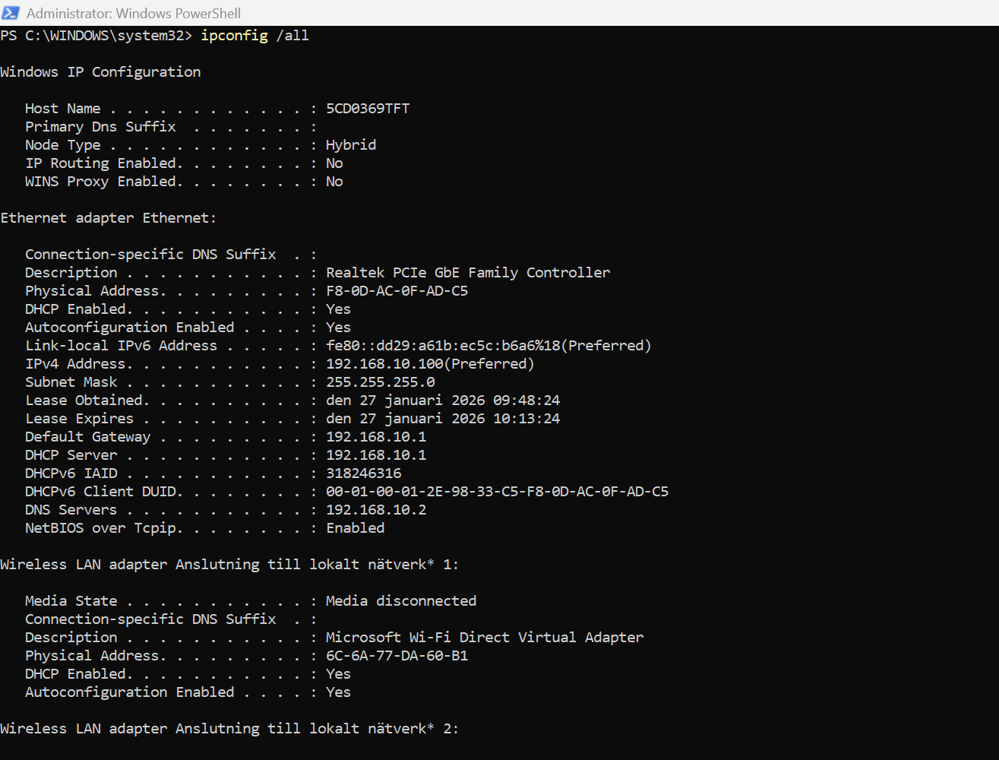
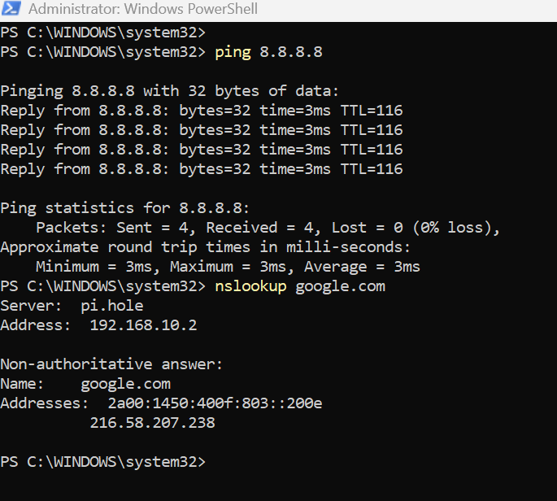
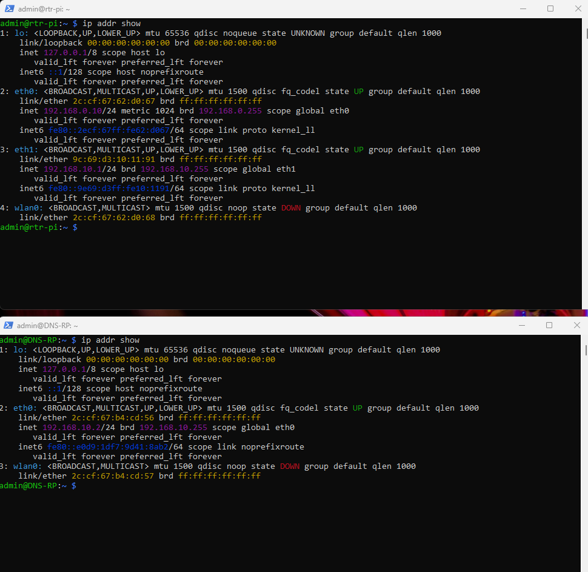
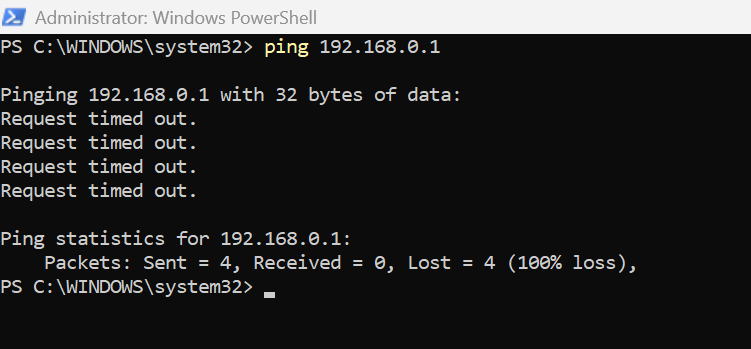
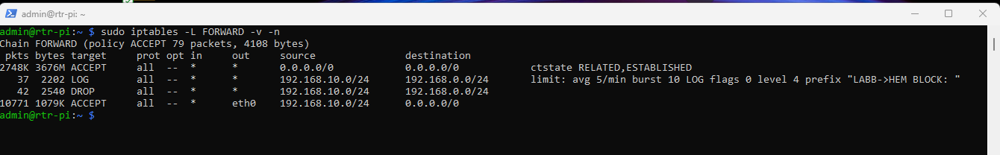
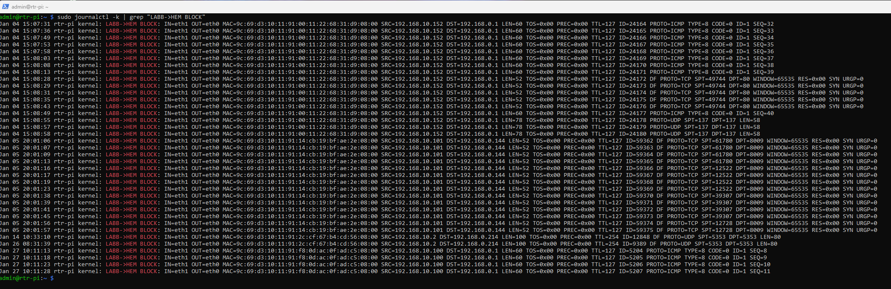
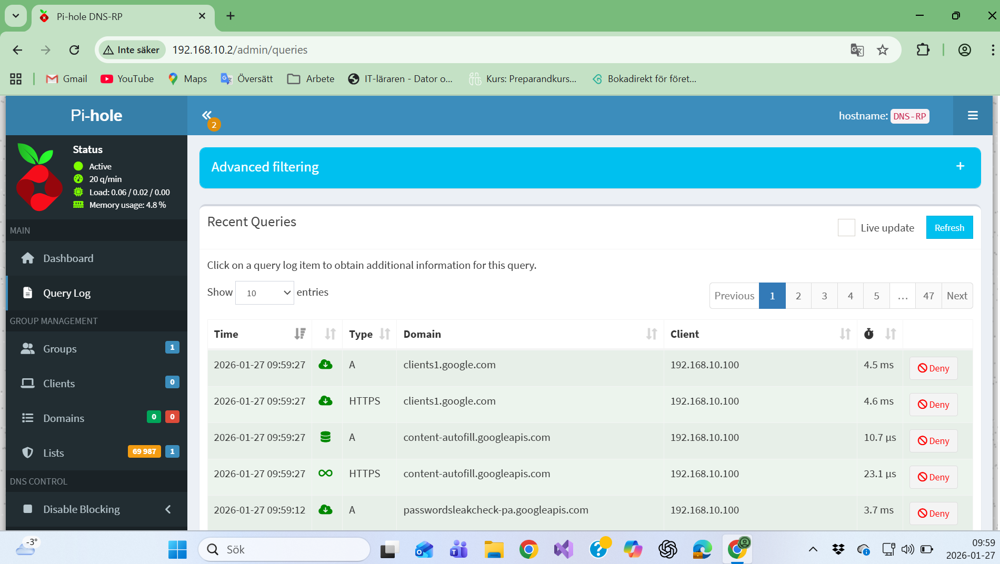
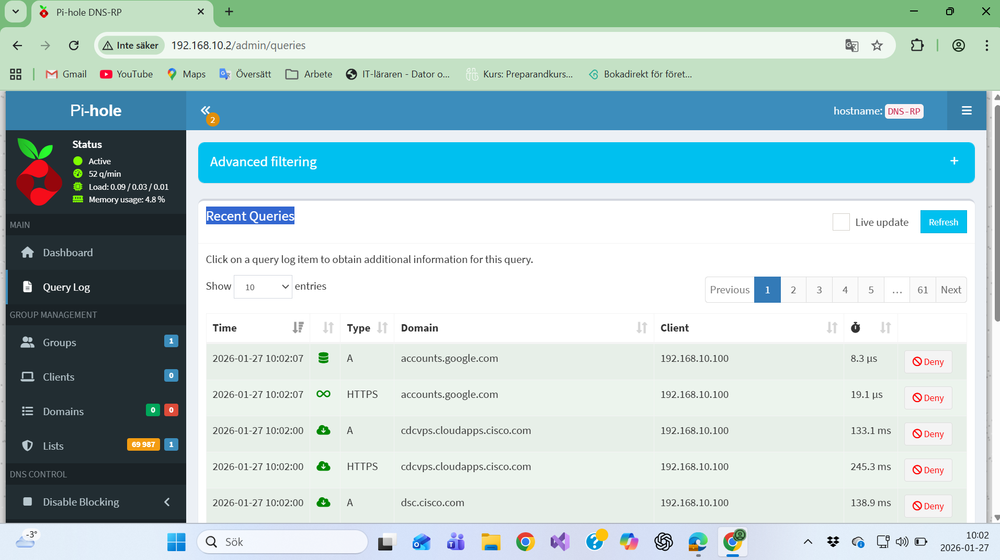

# Homelab – Network Segmentation, Firewall and IDS

## Overview
This project documents the design and implementation of a secure homelab built in parallel with a production home network.  
The goal is to enable safe experimentation with networking and security without impacting critical household services such as online banking, etc or IoT devices.

The project is created as a portfolio for upcoming LIA applications and entry-level roles within IT and IT security.

---

## Network Architecture
The environment is split into two logical zones using VLAN segmentation:

- **Home Network (VLAN 1):** 192.168.0.0/24  
- **Lab Network (VLAN 10):** 192.168.10.0/24  

A managed switch is used for Layer 2 separation, while routing, firewalling and monitoring are handled by a dedicated router.

---

## Components
- TP-Link Home Router (production network)
- Managed Switch (VLAN capable)
- Raspberry Pi – Router (routing, NAT, firewall, DHCP)
- Raspberry Pi – DNS (Pi-hole)
- Suricata IDS

---

## Routing and NAT
The lab network uses private addressing and is routed through a dedicated router.  
Source NAT (MASQUERADE) is applied to allow lab clients to access the internet without exposing internal addresses or requiring changes to the home network design.

---

## DNS Architecture
DNS for the lab network is handled by a dedicated Pi-hole instance.  
The lab router distributes the DNS server via DHCP, while DNS services on the router itself are disabled to maintain clear separation of roles.

---

## DHCP Configuration

### Design Decision

DHCP is intentionally separated between networks:

- Home network (VLAN 1) uses the TP-Link router for DHCP
- Lab network (VLAN 10) uses rtr-pi as the DHCP server

This prevents lab services from impacting production devices.

### Lab Network DHCP (rtr-pi)

The lab router (rtr-pi) runs `dnsmasq` to provide DHCP for VLAN 10.

DHCP scope:
- Network: `192.168.10.0/24`
- Lease range: `192.168.10.50 – 192.168.10.150`

DHCP options provided to lab clients:
- Default gateway: `192.168.10.1`
- DNS server: `192.168.10.2` (dns-pi / Pi-hole)
- Domain: `labb.local`

This ensures all lab clients:
- Route traffic via rtr-pi
- Use Pi-hole for DNS resolution
- Require no manual configuration

---

## Firewall and Security
Stateful firewall rules are implemented on the lab router to control traffic between networks:

- Lab network traffic to the internet is allowed
- Traffic from the lab network to the home network is blocked
- Management access (SSH) to the router is restricted to the home network
- Denied traffic is logged to provide visibility

---

## Intrusion Detection
A lightweight IDS using Suricata is deployed on the router to monitor lab traffic.  
Suspicious activity such as scanning behavior is detected and logged, providing insight into potential misconfigurations or security issues.

---

## Testing & Validation
### Lab client → Internet access
From a lab client connected to VLAN 10 (192.168.10.0/24):

```bash
ping 8.8.8.8
nslookup google.com
```

This confirms:
- NAT is working on rtr-pi
- Internet access is allowed from lab network

**Verification:**



**Verification: Internet access from lab network**

The lab client is able to reach the internet and resolve DNS via Pi-hole.



**Verification: Router and DNS IP addressing**

The router (rtr-pi) and DNS server (dns-pi) have correct IP addresses in their respective networks.



### Lab client → Home network isolation
Attempts to reach the home network from the lab network are blocked:

- `ping 192.168.0.1` fails
- Traffic is dropped by FORWARD chain rules

This confirms:
- Lab network cannot access production home network
- Firewall segmentation is enforced correctly

**Verification: Home network isolation**

Traffic from the lab network to the production home network is blocked.



### Firewall logging verification
Blocked lab → home traffic is logged for visibility and troubleshooting.

Logs are verified on rtr-pi using:

```bash
journalctl -k | grep "LABB->HEM BLOCK"
```

Example log entries show:

- Source IP from 192.168.10.0/24
- Destination IP in 192.168.0.0/24
- Traffic blocked as expected

**Verification: Firewall FORWARD chain rules**

The FORWARD chain enforces network segmentation and allows only intended traffic flows.



**Verification: Firewall logging**

Blocked traffic from the lab network to the home network is logged for visibility and troubleshooting.



### DNS resolution validation (Pi-hole)
DNS queries from lab clients are handled by Pi-hole:

- Lab client receives DNS server `192.168.10.2`
- Queries are visible in Pi-hole query log
- Blocked domains are enforced only in lab network

This confirms DNS isolation from the home network.

Overall, testing confirms that the lab network is fully isolated from the home network while maintaining controlled internet access, DNS visibility, and security monitoring.

**Verification: Pi-hole dashboard**

Pi-hole is active and handling DNS queries from lab clients.



**Verification: Pi-hole query log**

DNS queries from lab clients are visible in the Pi-hole query log.



---

## Project Structure
Detailed documentation and configurations are available in the following directories:

- `docs/` – Technical documentation and design explanations  
- `configs/` – Example configuration files  
- `screenshots/` – Verification screenshots  

---

## Learning Outcomes
This project demonstrates practical knowledge of:

- VLAN-based network segmentation
- Routing and NAT
- DHCP and DNS separation
- Stateful firewall design and rule ordering
- Logging and traffic visibility
- Intrusion detection using Suricata

---

## Lessons Learned

- DNS configuration affects critical services such as online banking 
- DHCP-based DNS distribution must be carefully scoped per network
- Firewall rule order is critical and evaluated top-down
- Logging is essential to verify and troubleshoot security policies
- Proper segmentation reduces blast radius during experimentation

---

## Future Improvements
- Centralized log collection
- Expanded IDS rule tuning
- Additional monitoring and alerting

## IDS & Attack Simulation

This lab was extended with:

- Suricata IDS for network monitoring
- Kali Linux as attacker machine
- Traffic analysis using flows and alerts

Full technical documentation:

[View IDS & Attack Simulation Lab](docs/ids-suricata.md)
