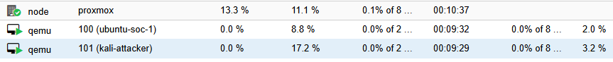
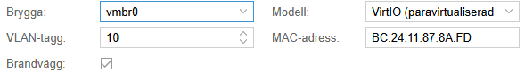
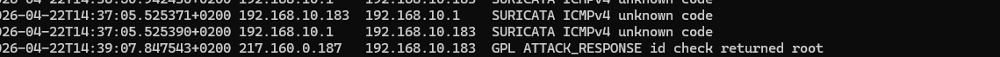
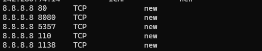
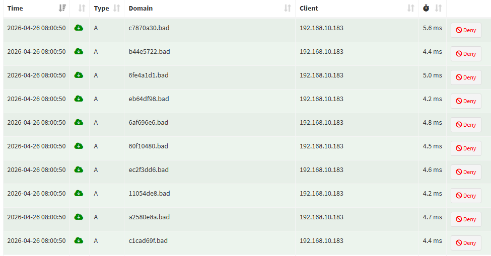

# Homelab – IDS & Attack Simulation

## Overview

This lab extends the homelab with:

- Suricata IDS for traffic analysis
- Kali Linux as attacker machine
- Realistic attack simulation and detection

The goal is to understand how network traffic looks during normal behavior vs attack activity, and how IDS detection works in practice.

---

## Architecture

### Physical host
- Lenovo mini-PC → Proxmox VE (hypervisor)

### Virtual machines


- rtr-pi (Router + Suricata IDS)
- dns-pi (Pi-hole DNS)
- Ubuntu Server (target system)
- Kali Linux (attacker)

### Network design



- Lab network: 192.168.10.0/24
- Segmented from home network
- Traffic routed via rtr-pi

---

## Suricata Setup

Suricata is running on rtr-pi and analyzing routed traffic.

Logs are written to:

/var/log/suricata/eve.json

Traffic is analyzed using:

- flow (network connections)
- http (application data)
- alert (IDS triggers)
- fileinfo (payload visibility)

Example command:

jq -r 'select(.event_type=="alert")' /var/log/suricata/eve.json

---

## Attack Simulation

Kali Linux is used to simulate attacker behavior inside the lab network.

IP address:
192.168.10.183

---

### IDS Test (Payload-based detection)

**Command:**

```bash
curl http://testmyids.com
```

**Result:**



A test payload triggered a Suricata alert, confirming that IDS detection is working.

### Nmap Scan (Reconnaissance)

**Command:**

```bash
nmap -sS 192.168.10.1
```

**Result:**

- High number of TCP flows (~6000)
- Many short-lived connections
- Several failed connections
- Few IDS alerts

**Interpretation:**

This behavior is consistent with reconnaissance / port scanning.

**Key learning:**

Scanning generates large amounts of traffic, but does not always trigger alerts.

---

### Traffic Analysis (Flow-based detection)



**Observed behavior:**

- Multiple connections to the same host
- Different destination ports
- Many connections in "new" state

**Interpretation:**

This pattern indicates scanning behavior. Even without strong IDS alerts, flow data reveals suspicious activity.

---

### DNS Analysis (Anomaly detection)



**Observed behavior:**

- High number of DNS queries in a short time window
- Randomized domain names (*.bad)
- Queries result in blocked or NXDOMAIN responses

**Interpretation:**

This behavior resembles automated DNS activity such as domain generation algorithms (DGA) or malware-like beaconing.

---

## Additional Traffic Observations

Observed traffic also included:

- TCP connections to gateway (192.168.10.1)
- ICMP (ping)
- HTTP requests to external servers
- APT traffic (system updates)

Example alerts:

- ET INFO GNU/Linux APT User-Agent
- Possible Kali Linux hostname (DHCP)
- IDS test alert

**Key learning:**

Not all alerts indicate attacks. Many are informational (“noise”).

---

## Key Insight – IDS Visibility

Suricata did NOT detect all attack traffic.

Explanation:

Traffic between hosts in the same VLAN does not pass through the router.

Therefore:

- Internal (east-west) traffic is not always visible
- IDS visibility depends on network placement

Key learning:

Detection is not only about tools – it is about where the sensor is placed in the network.

---

## SSH Hardening

Basic SSH hardening was implemented.

Changes:

- Disabled root login over SSH

Rationale:

Root accounts are common targets for brute force attacks. Disabling direct root login reduces risk and improves security posture.

---

## Current Status

- VLAN segmentation working
- Routing working
- DNS via Pi-hole working
- Suricata IDS active
- Kali attacker VM active
- Detection pipeline verified

---

## Next Steps

- Improve detection (trigger more IDS rules)
- Analyze flows in more detail (ports, states)
- Add Windows + Active Directory (IAM lab)
- Create detection use cases (SOC-style analysis)

---

## Detection Use Case – Port Scan

**Name:**
Port Scan Detection

**Description:**
Detects potential reconnaissance activity where a host scans multiple ports on a target system.

**Data source:**

- Suricata flow logs
- Suricata alerts

**Detection logic:**

- Multiple connections from one source IP
- Connections to many different destination ports
- High number of short-lived connections
- Many connections with state = "new"

**Indicators observed in lab:**

- ~6000 TCP flows from Kali (192.168.10.183)
- Connections to multiple ports on 192.168.10.1
- Large number of failed or incomplete connections
- Limited IDS alerts despite high activity

**Example behavior:**

- One source IP contacting many ports in a short time window
- No full session establishment
- Repeated connection attempts

**Interpretation:**

- This behavior is consistent with port scanning / reconnaissance activity.

**Limitations:**

- IDS alerts may be limited for scanning activity
- Detection relies heavily on flow analysis
- East-west traffic may not be visible depending on sensor placement

**Possible follow-up analysis:**

- Identify the source IP and confirm if it is an expected lab host
- Check whether the activity matches an intentional scan
- Compare flow data with DNS logs and IDS alerts
- Document whether the activity was expected, suspicious, or malicious